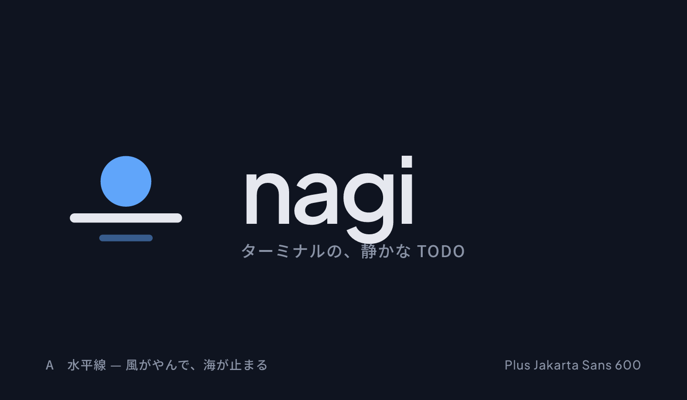
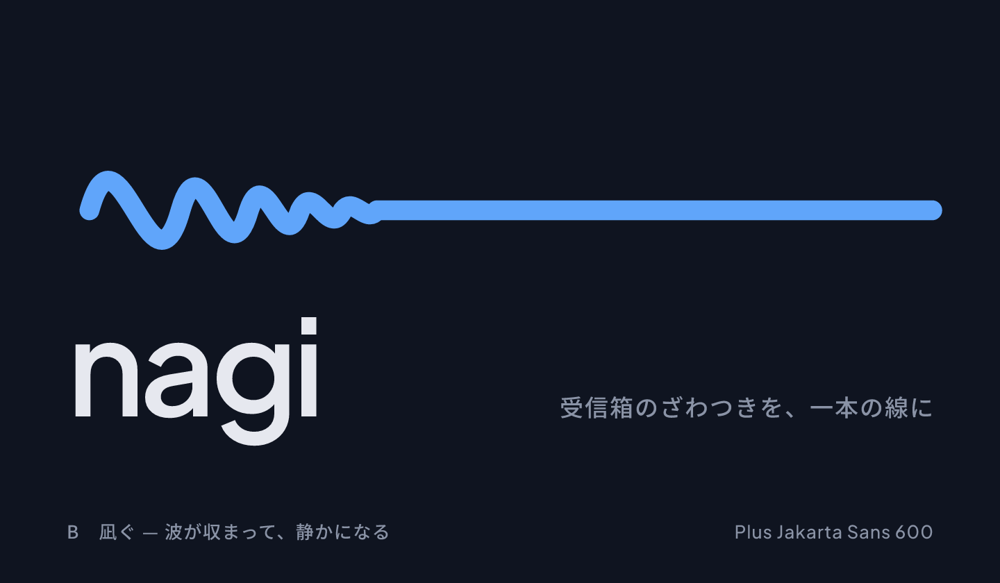
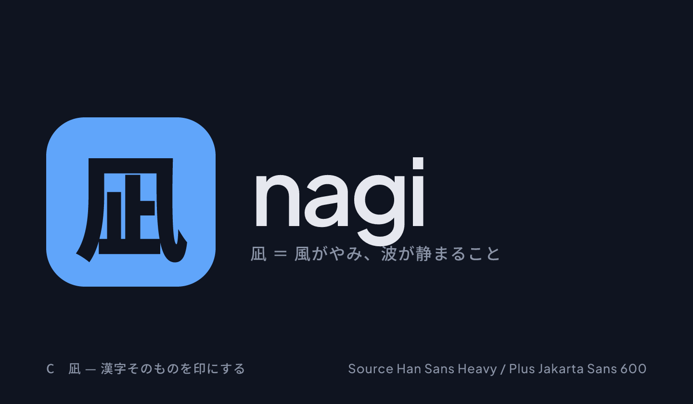
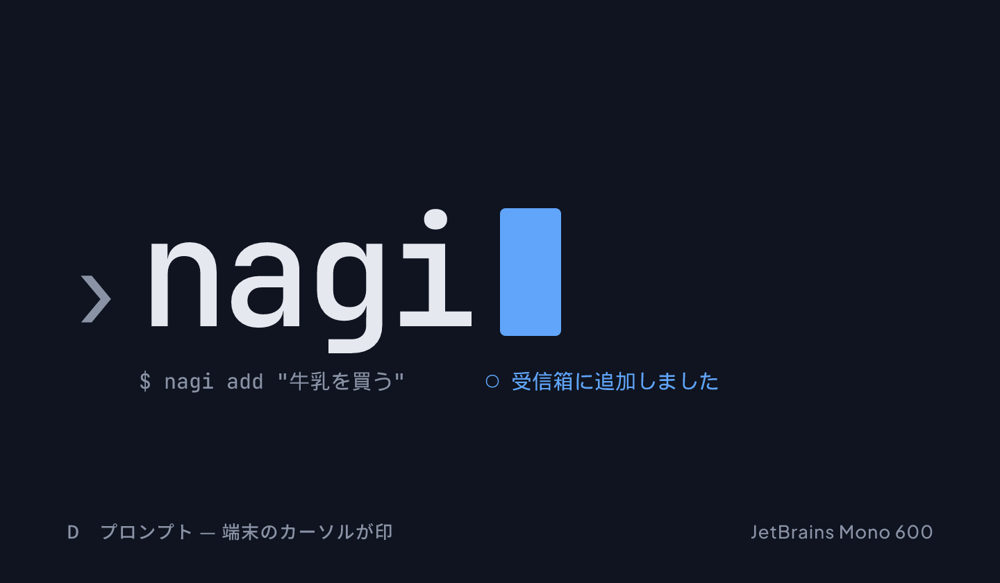
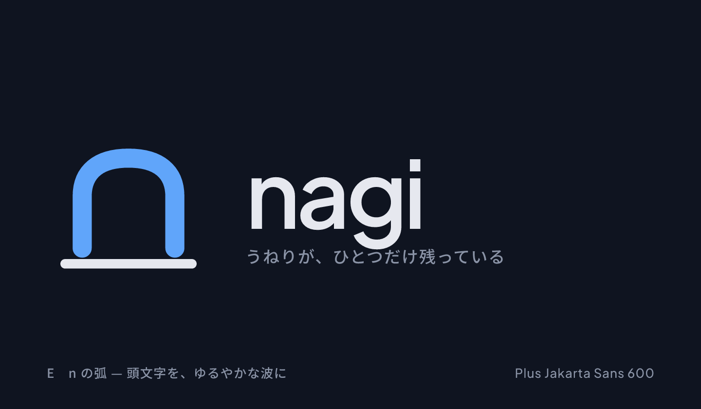
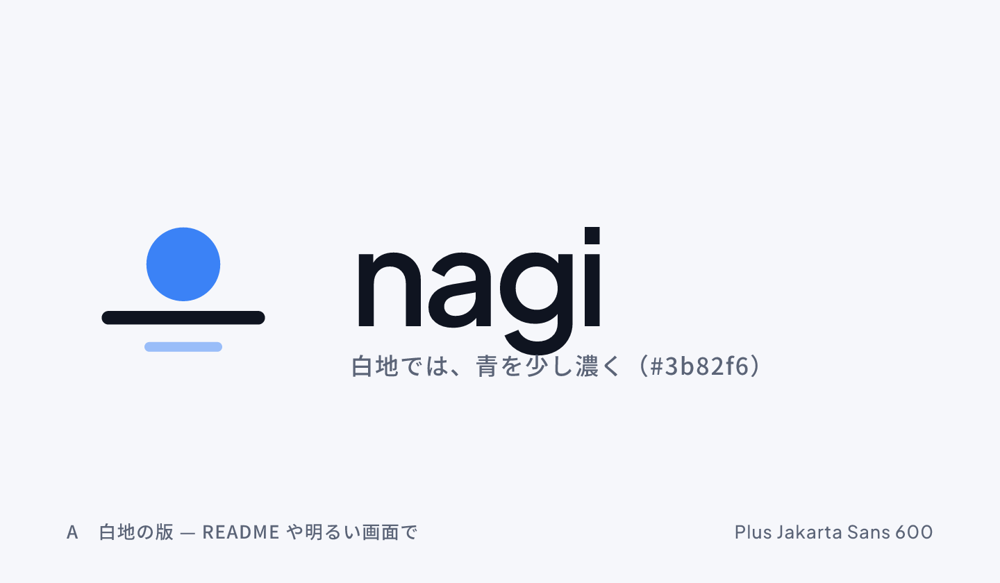
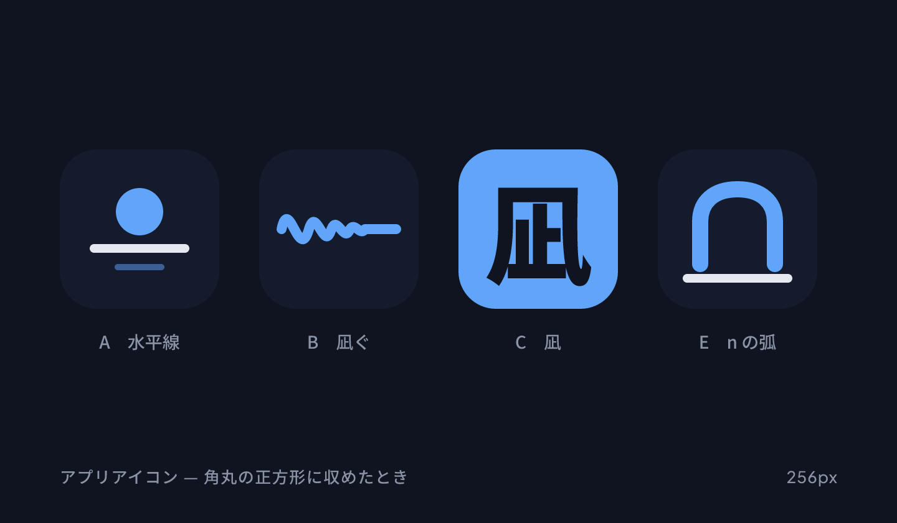

# nagi ロゴ案

「凪」（風がやんで海が静まる）を軸にした 6 つの方向。地は nagi の画面と同じ濃紺、印は青（`#60a5fa`）。
SVG が原本で、PNG はそれを描き出したもの（字体：Plus Jakarta Sans 600、D は JetBrains Mono、凪は Source Han Sans Heavy）。

## A　水平線 — 風がやんで、海が止まる

## B　凪ぐ — 波が収まって、静かになる

## C　凪 — 漢字そのものを印にする

## D　プロンプト — 端末のカーソルが印

## E　n の弧 — 頭文字を、ゆるやかな波に

## A　白地の版

## アプリアイコン（角丸の正方形に収めたとき）

