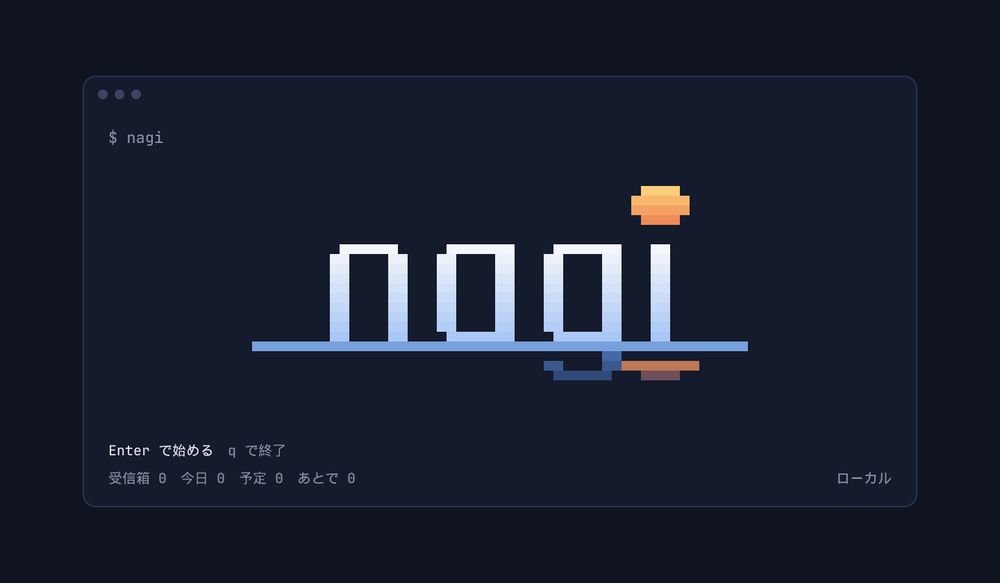
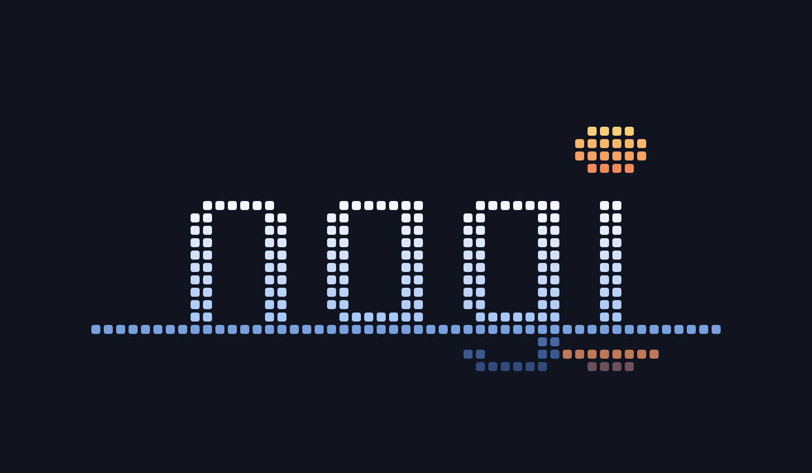
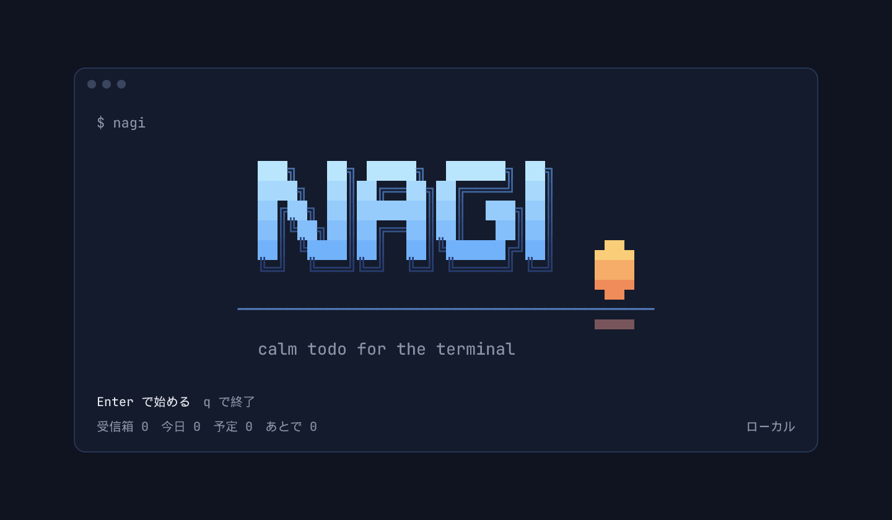

# nagi ロゴ案（第 3 案）

ほかの TUI（LazyVim・btop・yazi など）の起動画面を参考に、**細い線・グラデーション・水平線の構図**で作り直した 2 方向。
どちらも端末の文字（半ブロック ▀▄█ と罫線）で描けるので、画面の中と画像で同じ形になる。

## A　水平線の上の nagi

小文字の細い字（線 2 ピクセル、角を丸める）が水平線の上に載り、**i の点が太陽**。g の下の部分は水面の下（暗い青）。
文字は白→淡い青、太陽は琥珀→橙のグラデーション。端末では 51 列 × 11 行。



ドット：



ベタ塗り：


色なしで、そのまま端末に貼れる形：

```text

                                       ▄████▄
                                       ▀████▀

        ▄█▀▀▀▀█▄   ▄█▀▀▀▀██   ▄█▀▀▀▀██   ██
        ██    ██   ██    ██   ██    ██   ██
        ██    ██   ██    ██   ██    ██   ██
        ██    ██   ██    ██   ██    ██   ██
        ██    ██   ▀█▄▄▄▄██   ▀█▄▄▄▄██   ██
▀▀▀▀▀▀▀▀▀▀▀▀▀▀▀▀▀▀▀▀▀▀▀▀▀▀▀▀▀▀▀▀▀▀▀▀██▀▀▀▀▀▀▀▀▀▀▀▀▀
                              ▀█▄▄▄▄█▀▀▀████▀▀
```

## B　大文字のブロック体（ANSI Shadow）

多くの TUI が使う figlet の「ANSI Shadow」で NAGI。空色→青のグラデーションに、暗い青の影。下に水平線と太陽。端末では 42 列 × 10 行。



## 前の案

- `second-round/`：ピクセルの太い字（線 3 ピクセル）
- `first-round/`：最初の 6 案（ベクターの図案）
