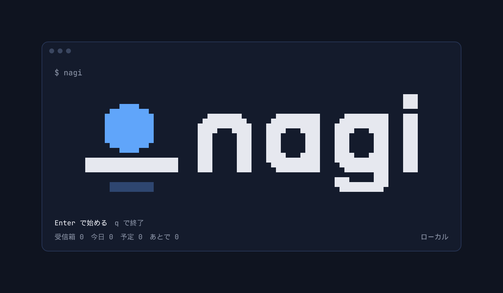
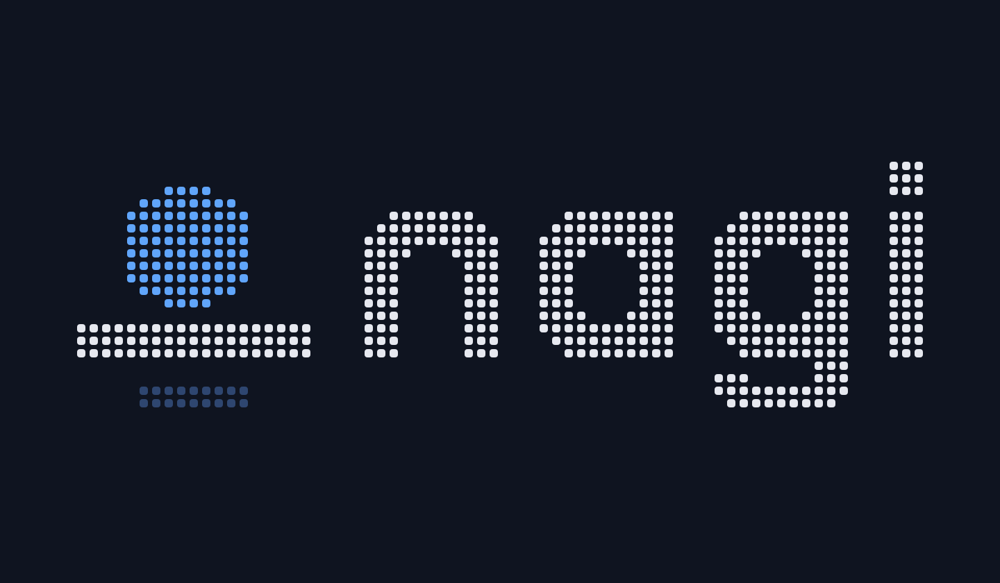
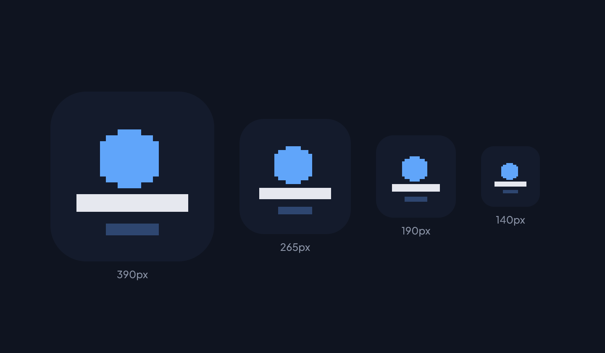

# nagi ロゴ案（第 2 案：ピクセル）

端末の 1 文字（半ブロック ▀▄█）をそのまま 1 ピクセルにした、ピクセルのロゴ。**同じビットマップから、画像（SVG・PNG）と、TUI に出す文字のロゴの両方を作る**ので、画面の中と外で同じ形になる。
線の太さは 3 ピクセル、角を 1 ピクセル落として丸く見せる。印は「水平線に浮かぶ太陽と、水面の反射」。

- 原本は `bitmap.json`（`pix.py` が作る）。`render.py` が SVG を書き出す
- 端末では 68 列 × 10 行。色は、太陽が青（`#60a5fa`）、文字と水平線が明るい灰、反射が濃い青

## 画面の中（TUI の起動画面・ログインの画面などに出すとき）



そのまま端末に貼れる形（色なし）：

```text
                                                                 ███
     ▄▄████▄▄                                                    ▀▀▀
    ██████████          ▄███████▄     ▄█████████    ▄█████████   ███
    ██████████         ████▀▀▀████   ████▀▀▀████   ████▀▀▀████   ███
    ██████████         ███     ███   ███     ███   ███     ███   ███
     ▀▀████▀▀          ███     ███   ███     ███   ███     ███   ███
▄▄▄▄▄▄▄▄▄▄▄▄▄▄▄▄▄▄▄    ███     ███   ████▄▄▄████   ████▄▄▄████   ███
███████████████████    ███     ███    ▀█████████    ▀█████████   ███
                                                   ▄▄▄     ███
     █████████                                     ▀█████████▀
```

## 画像として

ベタ塗り：


ドット（LED のように、すこし間を空けて角を丸める）：



白地：


## アイコン


小さいサイズでの見え方：



## 前の案

最初に出した 6 案は `first-round/` にある。
